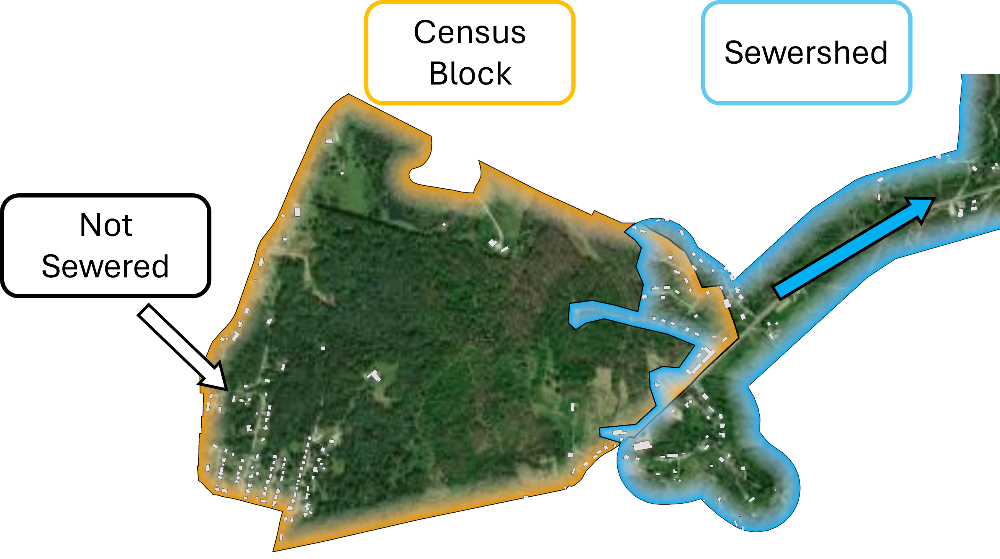

**Current Release: Version 1.2 (Updated May 21, 2026)**

## Version 1.2 Release Notes

Version 1.2 of the Sewershed dataset was released on May 21, 2026.

### Census Crosswalk Files

Census crosswalk files are now available for sewersheds. Go to 'V_1_2/crosswalks/' to download. There are three available geographies:
census blocks, block groups and tracts. Crosswalks were developed using microsoft building footprints to weight census block populations where sewersheds do not completely contain a census block.

Method:
Microsoft building footprints are filtered to those that are at least 40 square meters (roughly the size of a two-car garage). 
Building centroids are then intersected with census blocks and overlapping areas of sewersheds + census blocks. Block weights are 
then calculated as the count of buildings within a block that are also within a sewershed, divided by the total number of buildings within that block.
This method gives a more accurate weight of census demographics relative to standard area weighting techniques.

#### Crosswalk Column Descriptions 

| column          | description                                                                                   |
|-----------------|-----------------------------------------------------------------------------------------------|
| CWNS_ID    | Unique identifier for each POTW (sewershed) |
| GEOID | Census designated unique identifier |
| *Population | The weighted population of the sewershed / census geography pair |
| *Buildings | The weighted count of buildings > 40m^2 of the sewershed / census geography pair |
| Crosswalk_Multiplier | Multiply census counts by this value to obtain the weighted estimate for the sewershed / census pair |

### Additional Sources

- 35 new utility sourced sewersheds were included
- Corrections to Rhode Island Sewersheds

**Current breakdown of sourced vs. modeled sewersheds**

3,253 sourced, 13,826 modeled (19% sourced).

See 'sources.csv' for an up to date list of sources for sewershed data.

**Metadata for the source information of sewershed data.**

| column          | description                                                                                   |
|-----------------|-----------------------------------------------------------------------------------------------|
| CWNS_ID    | Unique identifier for each POTW (sewershed) |
| POTW_Name | The POTW name as listed in the CWNS |
| Source_Name | Name of the data source |
| How_Obtained | How the data was obtained (public download / feedback portal / email communication) |
| Source_Path | URL (if applicable) that data was retrieved from |
| Feature_Type | The type of data obtained, for example a service area polygon or sewer lines |
| Method | The method used to derive the service area |
| Date_Obtained | The date EPA obtained the data |
| Version_Added | The first version that the data was added to the sewershed dataset |